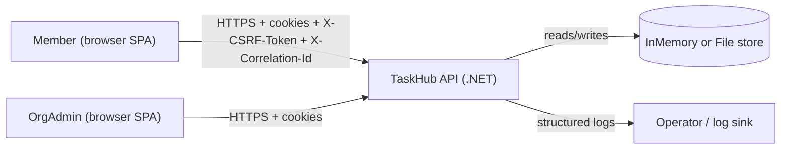
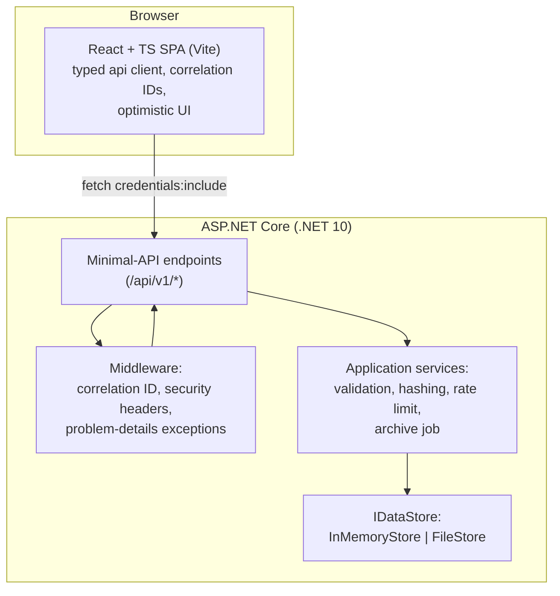

# 08 — Architecture (C4)

## Context (C4 L1)

## Container (C4 L2)

## Component — backend (C4 L3)
- `Api/Endpoints.cs` — thin route handlers: authN/Z checks, validation calls, ETag
  enforcement, DTO mapping. No business rules duplicated.
- `Api/Contracts.cs` — DTOs + Problem Details helper.
- `Application/Validation.cs`, `PasswordHasher.cs`, `Security.cs`, `ArchiveJob.cs` —
  testable domain/application logic (no HttpContext except Security helpers).
- `Domain/Entities.cs` — records: User, Organisation, Membership, Todo, Session, AuditEntry.
- `Infrastructure/Store.cs` — `IDataStore` + `InMemoryStore` + `FileStore`
  (atomic temp+rename writes, semaphore gate, v1→v2 migration).
- `Program.cs` — composition root: provider switch (`STORAGE_PROVIDER`), rate-limiter
  config, Swagger, health, archive job registration.

## Storage provider switching
`STORAGE_PROVIDER=InMemory|File` (env wins over `Storage:Provider`). `File` also reads
`STORAGE_FILE_DIR`. Both implement `IDataStore`; all endpoints depend only on the
interface, so behaviour (incl. version semantics) is identical. File layout: single
`{dir}/taskhub-store.json` (+ `.tmp` during write, `.bak` manual backups).
Locking: one `SemaphoreSlim(1,1)` guards load/save; writes are full-snapshot
serializations to temp file + atomic `File.Move(overwrite:true)`.

## Boundaries & dependencies
Inbound: SPA only (CORS allow-lists localhost dev origins; same-origin via proxy in dev).
Outbound: none (no mail/SMS/cloud). Dependencies: Swashbuckle (OpenAPI),
xUnit + Mvc.Testing (tests), React/Vite/Vitest/Playwright (frontend) — see
docs/13-dependency-register.md.
